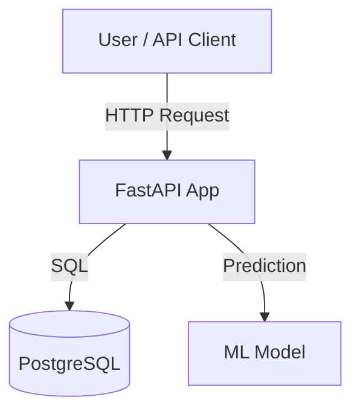

# 🎬 TMDB Box Office Revenue Prediction

Predict movie box office revenue using machine learning and data from [The Movie Database (TMDB)](https://www.themoviedb.org/).

---

## 🚀 Overview

This project provides a fast, modern API for predicting box office revenue based on movie metadata.  
It uses a machine learning model, a PostgreSQL database, and a web API built with FastAPI.

---

## 🏗️ Architecture



- **FastAPI:** Serves the REST API for predictions and data management.
- **PostgreSQL:** Stores movie data and prediction logs.
- **ML Model:** Predicts box office revenue based on input features, based of XGBoost, LightGBM, CatBoost

---

## 🐳 Quick Start with Docker

### 1. **Clone the repository**

```bash
git clone https://github.com/a1mohamad/tmdb-prediction.git
cd tmdb-boxoffice-prediction
```

### 2. **Configure Environment Variables**

Create a `.env` file if needed (see `.env.example`).

### 3. **Build and Run with Docker Compose**

```bash
docker compose up --build
```

- The API will be available at [http://localhost:8000](http://localhost:8000)
- API docs at [http://localhost:8000/docs](http://localhost:8000/docs)

---

## 📦 Project Structure

```
project/
├── app/                # FastAPI application source code
│   ├── main.py
│   ├── inference.py    
│   ├── schemas.py
│   ├── train.py
│   ├── utils.py
│   ├── pipeline.py
│   ├── __init__.py 
├── models/                 # Machine learning model code & artifacts
│   ├── final_cat.pkl
│   ├── final_xgb.pkl 
│   ├── final_lgb.pkl
│   ├── blend_config.pkl
│   ├── train_dict.pkl
│   ├── global_stats.pkl
├── scripts/
├── data/               # Data loading scripts or sample data
├── requirements.txt
├── Dockerfile
├── .dockerignore
├── docker-compose.yml
├── README.md
```

---

## 🛠️ API Usage

Once running, visit the [Swagger UI](http://localhost:8000/docs) for interactive docs.

### Example: Predict Revenue

```json
POST /predict
{
  "title": "Inception",
  "budget": 160000000,
  "genres": ["Action", "Sci-Fi"],
  "runtime": 148,
  "release_date": "2010-07-16",
  ...
}
```

_Response:_
```json
{
  "revenue_prediction": 825532764
}
```

---

## ⚡ Development

- Make sure you have [Docker](https://www.docker.com/) and [Docker Compose](https://docs.docker.com/compose/) installed.
- To run without Docker, create a virtual environment and install dependencies from `requirements.txt`.

---

## 🧹 Cleaning Up

After testing, stop and remove containers:
```bash
docker compose down
```
Remove unused images:
```bash
docker image prune -a
```

---

## 📝 License

MIT License. See [LICENSE](LICENSE) for details.

---

## 🙏 Credits

- [TMDB API](https://www.themoviedb.org/documentation/api)
- [FastAPI](https://fastapi.tiangolo.com/)
- [Pydantic](https://docs.pydantic.dev/)
- [PostgreSQL](https://www.postgresql.org/)
- [Docker](https://www.docker.com/)
- [pandas](https://pandas.pydata.org/)
- [LightGBM](https://lightgbm.readthedocs.io/)
- [XGBoost](https://xgboost.readthedocs.io/)
- [CatBoost](https://catboost.ai/)

---

> **Made with ❤️ for data science and movie enthusiasts!**